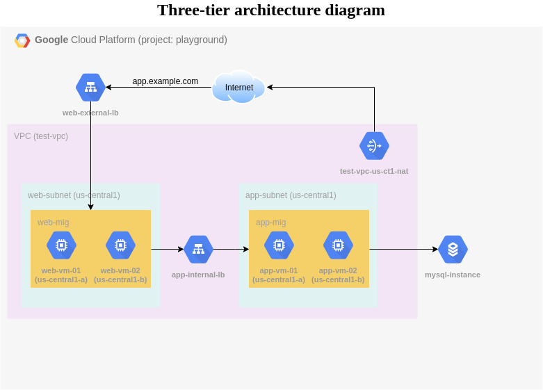

# Three-tier Architecture

This project has terraform modules for creating the following resources on GCP.

- VPC
- Subnet
- NAT gateway & Router
- Firewall Rules
- Service Account & Custom Roles
- Managed Instance Groups
- CloudSQL Instance
- Internal Loadbalancer
- External Loadbalancer

Pending:
- Private DNS Record
- Public DNS Record
- Custom Application Deployment

The architecture diagram is as follows:

